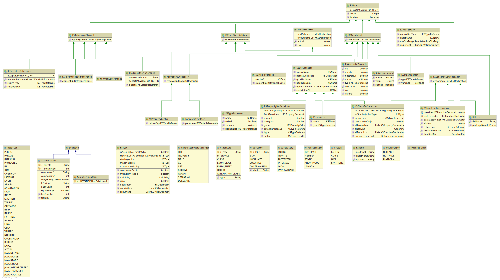

# How KSP models Kotlin code

The API definition can be found [here](api/src/main/kotlin/com/google/devtools/ksp/).
The diagram below is an overview of how Kotlin is [modeled](api/src/main/kotlin/com/google/devtools/ksp/symbol/) in KSP:


## Type and resolution

In KSP, references to types are designed to be resolved by processors
explicitly (with a few exceptions) because most of the cost of the
underlying API implementation is in resolution. When a _type_ is referenced,
such as `KSFunctionDeclaration.returnType` or `KSAnnotation.annotationType`,
it is always a `KSTypeReference`, which is a `KSReferenceElement` with
annotations and modifiers.

```kotlin
interface KSFunctionDeclaration : ... {
  val returnType: KSTypeReference?
  ...
}

interface KSTypeReference : KSAnnotated, KSModifierListOwner {
  val type: KSReferenceElement
}
```

A `KSTypeReference` can be resolved to a `KSType`, which refers to a type in
Kotlin's type system.

A `KSTypeReference` has a `KSReferenceElement`, which models Kotlin‘s program
structure: namely, how the reference is written. It corresponds to the
[`type`](https://kotlinlang.org/docs/reference/grammar.html#type) element in
Kotlin's grammar.

A `KSReferenceElement` can be a `KSClassifierReference` or
`KSCallableReference`, which contains a lot of useful information without
the need for resolution. For example, `KSClassifierReference` has
`referencedName`, while `KSCallableReference` has `receiverType`,
`functionArguments`, and `returnType`.

If the original declaration referenced by a `KSTypeReference` is needed,
it can usually be found by resolving to `KSType` and accessing through
`KSType.declaration`. Moving from where a type is mentioned to where its
class is defined looks like this:

```kotlin
KSTypeReference -> .resolve() -> KSType -> .declaration -> KSDeclaration
```

Type resolution is costly and is therefore made explicit. Some of the
information obtained from resolution is already available in
`KSReferenceElement`. For example, `KSClassifierReference.referencedName`
can filter out a lot of elements that are not interesting. You should
resolve type only if you need specific information from `KSDeclaration`
or `KSType`.

Note that a `KSTypeReference` pointing to a function type has most of its
information in its element. Although it can be resolved to the family of
`Function0`, `Function1`, and so on, these resolutions don‘t bring any
more information than `KSCallableReference`. One use case for resolving
function type references is dealing with the identity of the function's
prototype.
