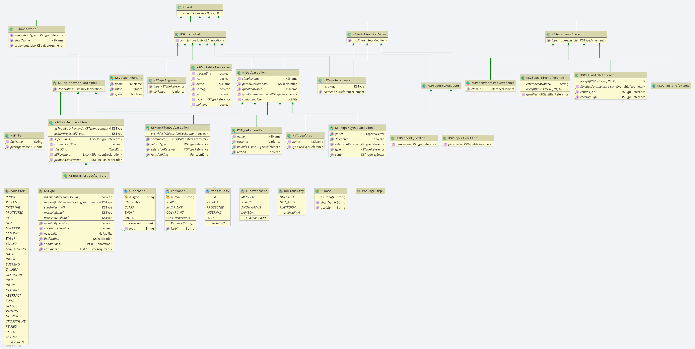

# Kotlin Symbol Processing API

Compiler plugins are powerful metaprogramming tools that can greatly enhance
how you write code. Compiler plugins call compilers directly as libraries to
analyze and edit input programs. These plugins can also generate output for
various uses. For example, they can generate boilerplate code, and they can
even generate full implementations for specially-marked program elements,
such as `Parcelable`. Plugins have a variety of other uses and can even be used
to implement and fine-tune features that are not provided directly in a
language.

While compiler plugins are powerful, this power comes at a price. To write
even the simplest plugin, you need to have some compiler background
knowledge, as well as a certain level of familiarity with the
implementation details of your specific compiler. Another practical
issue is that plugins are often closely tied to specific compiler
versions, meaning you might need to update your plugin each time you
want to support a newer version of the compiler.

## KSP makes creating lightweight compiler plugins easier

Kotlin Symbol Processing (KSP) is an API that you can use to develop
lightweight compiler plugins. KSP provides a simplified compiler plugin
API that leverages the power of Kotlin while keeping the learning curve at
a minimum. KSP is designed to hide compiler changes, minimizing maintenance
efforts for processors that use it. KSP is designed not to be tied to the
JVM so that it can be adapted to other platforms more easily in the future.
KSP is also designed to minimize build times. For some processors, such as
[Glide](https://github.com/bumptech/glide), KSP reduces full compilation
times by up to 25% when compared to KAPT.

KSP is itself implemented as a compiler plugin, and the experimental KSP
repository is a fork of JetBrains/kotlin. There are also prebuilt packages
on Google's Maven repository that you can download and use without having
to build the project yourself. For more information, see
[Try it out](#try)!

The KSP API processes Kotlin programs idiomatically. KSP understands
Kotlin-specific features, such as extension functions, declaration-site
variance, and local functions. KSP also models types explicitly and
provides basic type checking, such as equivalence and assign-compatibility.

The API models Kotlin program structures at the symbol level according to
[Kotlin grammar](https://kotlinlang.org/docs/reference/grammar.html). When
KSP-based plugins process source programs, constructs like classes, class
members, functions, and associated parameters are easily accessible for the
processors, while things like if blocks and for loops are not.

Conceptually, KSP is similar to
[KType](https://kotlinlang.org/api/latest/jvm/stdlib/kotlin.reflect/-k-type/)
in Kotlin reflection. The API allows processors to navigate from class
declarations to corresponding types with specific type arguments and
vice-versa. Substituting type arguments, specifying variances, applying
star projections, and marking nullabilities of types are also possible.

Another way to think of KSP is as a pre-processor framework of Kotlin
programs. If we refer to KSP-based plugins as _symbol processors_, or
simply _processors_, then the data flow in a compilation can be described
in the following steps:

1. Processors read and analyze source programs and resources.
1. Processors generate code or other forms of output.
1. The Kotlin compiler compiles the source programs together with the
   generated code.

Unlike a full-fledged compiler plugin, processors cannot modify the code.
A compiler plugin that changes language semantics can sometimes be very
confusing. KSP avoids that by treating the source programs as read-only.

## How KSP looks at source files

Most processors navigate through the various program structures of the
input source code. Before diving into usage of the API, let's look at how
a file might look from KSP's point of view:

```kotlin
KSFile
  packageName: KSName
  fileName: String
  annotations: List<KSAnnotation>  (File annotations)
  declarations: List<KSDeclaration>
    KSClassDeclaration // class, interface, object
      simpleName: KSName
      qualifiedName: KSName
      containingFile: String
      typeParameters: KSTypeParameter
      parentDeclaration: KSDeclaration
      classKind: ClassKind
      primaryConstructor: KSFunctionDeclaration
      superTypes: List<KSTypeReference>
      // contains inner classes, member functions, properties, etc.
      declarations: List<KSDeclaration>
    KSFunctionDeclaration // top level function
      simpleName: KSName
      qualifiedName: KSName
      containingFile: String
      typeParameters: KSTypeParameter
      parentDeclaration: KSDeclaration
      functionKind: FunctionKind
      extensionReceiver: KSTypeReference?
      returnType: KSTypeReference
      parameters: List<KSVariableParameter>
      // contains local classes, local functions, local variables, etc.
      declarations: List<KSDeclaration>
    KSPropertyDeclaration // global variable
      simpleName: KSName
      qualifiedName: KSName
      containingFile: String
      typeParameters: KSTypeParameter
      parentDeclaration: KSDeclaration
      extensionReceiver: KSTypeReference?
      type: KSTypeReference
      getter: KSPropertyGetter
        returnType: KSTypeReference
      setter: KSPropertySetter
        parameter: KSVariableParameter
    KSEnumEntryDeclaration
      // same as KSClassDeclaration
```

This view lists common things that are declared in the file--classes,
functions, properties, enums, and so on.

## SymbolProcessor: The entry point

Every processor in KSP implements `SymbolProcessor`:

```kotlin
interface SymbolProcessor {
    fun init(options: Map<String, String>,
             kotlinVersion: KotlinVersion,
             codeGenerator: CodeGenerator,
             logger: KSPLogger)
    fun process(resolver: Resolver) // Let's focus on this
    fun finish()
}
```

A `Resolver` provides `SymbolProcessor` with access to compiler details
such as symbols. A processor that finds all top-level functions and non-local functions in top-level
classes might look something like this:

```kotlin
class HelloFunctionFinderProcessor : SymbolProcessor() {
    ...
    val functions = mutableListOf<String>()
    val visitor = FindFunctionsVisitor()

    override fun process(resolver: Resolver) {
        resolver.getAllFiles().map { it.accept(visitor, Unit) }
    }

    inner class FindFunctionsVisitor : KSVisitorVoid() {
        override fun visitClassDeclaration(classDeclaration: KSClassDeclaration, data: Unit) {
            classDeclaration.getDeclaredFunctions().map { it.accept(this, Unit) }
        }

        override fun visitFunctionDeclaration(function: KSFunctionDeclaration, data: Unit) {
            functions.add(function)
        }

        override fun visitFile(file: KSFile, data: Unit) {
            file.declarations.map { it.accept(this, Unit) }
        }
    }
    ...
}
```

## Examples

Get all member functions that are declared directly within a class:

```kotlin
fun KSClassDeclaration.getDeclaredFunctions(): List<KSFunctionDeclaration> {
    return this.declarations.filterIsInstance<KSFunctionDeclaration>()
}
```

Determine whether a class or function is local to another function:

```kotlin
fun KSDeclaration.isLocal(): Boolean {
    return this.parentDeclaration != null && this.parentDeclaration !is KSClassDeclaration
}
```

Determine whether a class member is visible to another:

```kotlin
fun KSDeclaration.isVisibleFrom(other: KSDeclaration): Boolean {
    return when {
        // locals are limited to lexical scope
        this.isLocal() -> this.parentDeclaration == other
        // file visibility or member
        this.isPrivate() -> {
            this.parentDeclaration == other.parentDeclaration
                    || this.parentDeclaration == other
                    || (
                        this.parentDeclaration == null
                            && other.parentDeclaration == null
                            && this.containingFile == other.containingFile
                    )
        }
        this.isPublic() -> true
        this.isInternal() && other.containingFile != null && this.containingFile != null -> true
        else -> false
    }
}
```

### Example annotations

```kotlin
// Find out suppressed names in a file annotation:
// @file:kotlin.Suppress("Example1", "Example2")
fun KSFile.suppressedNames(): List<String> {
    val ignoredNames = mutableListOf<String>()
    annotations.forEach {
        if (it.shortName.asString() == "Suppress" && it.annotationType.resolve()?.declaration?.qualifiedName?.asString() == "kotlin.Suppress") {
            it.arguments.forEach {
                (it.value as List<String>).forEach { ignoredNames.add(it) }
            }
        }
    }
    return ignoredNames
}
```

## Additional details

The API definition can be found [here](src/org/jetbrains/kotlin/ksp/).
The diagram below is an overview of how Kotlin is [modeled](src/org/jetbrains/kotlin/ksp/symbol/) in KSP:


### Type and resolution

In KSP, references to types are designed to be resolved by processors
explicitly (with a few exceptions) because most of the cost of the
underlying API implementation is in resolution. When a _type_ is referenced,
such as `KSFunctionDeclaration.returnType` or `KSAnnotation.annotationType`,
it is always a `KSTypeReference`, which is a `KSReferenceElement` with
annotations and modifiers.

```kotlin
interface KSFunctionDeclaration : ... {
  val returnType: KSTypeReference?
  ...
}

interface KSTypeReference : KSAnnotated, KSModifierListOwner {
  val type: KSReferenceElement
}
```

A `KSTypeReference` can be resolved to a `KSType`, which refers to a type in
Kotlin's type system.

A `KSTypeReference` has a `KSReferenceElement`, which models Kotlin‘s program
structure: namely, how the reference is written. It corresponds to the
[`type`](https://kotlinlang.org/docs/reference/grammar.html#type) element in
Kotlin's grammar.

A `KSReferenceElement` can be a `KSClassifierReference` or
`KSCallableReference`, which contains a lot of useful information without
the need for resolution. For example, `KSClassifierReference` has
`referencedName`, while `KSCallableReference` has `receiverType`,
`functionArguments`, and `returnType`.

If the original declaration referenced by a `KSTypeReference` is needed,
it can usually be found by resolving to `KSType` and accessing through
`KSType.declaration`. Moving from where a type is mentioned to where its
class is defined looks like this:

```kotlin
KSTypeReference -> .resolve() -> KSType -> .declaration -> KSDeclaration
```

Type resolution is costly and is therefore made explicit. Some of the
information obtained from resolution is already available in
`KSReferenceElement`. For example, `KSClassifierReference.referencedName`
can filter out a lot of elements that are not interesting. You should
resolve type only if you need specific information from `KSDeclaration`
or `KSType`.

Note that a `KSTypeReference` pointing to a function type has most of its
information in its element. Although it can be resolved to the family of
`Function0`, `Function1`, and so on, these resolutions don‘t bring any
more information than `KSCallableReference`. One use case for resolving
function type references is dealing with the identity of the function's
prototype.

## Comparison to `kotlinc` compiler plugins

`kotlinc` compiler plugins have access to almost everything from the compiler
and therefore have maximum power and flexibility. On the other hand, because
these plugins can potentially depend on anything in the compiler, they are
sensitive to compiler changes and need to be maintained frequently. These plugins
also require a deep understanding of `kotlinc`’s implementation, so the learning
curve can be steep.

KSP aims to hide most compiler changes through a well-defined API, though major
changes in compiler or even the Kotlin language might still require to be
exposed to API users.

KSP tries to fulfill common use cases by providing an API that trades power for
simplicity. Its capability is a strict subset of a general `kotlinc` plugin.
For example, while `kotlinc` can examine expressions and statements and can even
modify code, KSP cannot.

While writing a `kotlinc` plugin can be a lot of fun, it can also take a lot of
time. If you aren't in a position to learn `kotlinc`’s implementation and do
not need to modify source code or read expressions, KSP might be a good fit.

## Comparison to reflection

KSP's API looks similar to `kotlin.reflect`. The major difference between
them is that type references in KSP need to be resolved explicitly. This is
one of the reasons why the interfaces are not shared.

## Comparison to KAPT

[KAPT](https://kotlinlang.org/docs/reference/kapt.html) is a remarkable
solution which makes a large amount of Java annotation processors work
for Kotlin programs out-of-box. The major advantages of KSP over KAPT are
improved build performance, not tied to JVM, a more idiomatic Kotlin
API, and the ability to understand Kotlin-only symbols.

To run Java annotation processors unmodified, KAPT compiles Kotlin code
into Java stubs that retain information that Java annotation processors
care about. To create these stubs, KAPT needs to resolve all symbols in
the Kotlin program. The stub generation costs roughly 1/3 of a full
`kotlinc` analysis and the same order of `kotlinc` code-generation. For
many annotation processors, this is much longer than the time spent in
the processors themselves. For example, Glide looks at a very limited
number of classes with a predefined annotation, and its code generation
is fairly quick. Almost all of the build overhead resides in the stub
generation phase. Switching to KSP would immediately reduce the time
spent in the compiler by 25%.

For performance evaluation, we implemented a
[simplified version](https://github.com/android/kotlin/releases/download/sample/miniGlide.zip)
of [Glide](https://github.com/bumptech/glide) in KSP to make it generate code
for the [Tachiyomi](https://github.com/inorichi/tachiyomi) project. While
the total Kotlin compilation time of the project is 21.55 seconds on our
test device, it took 8.67 seconds for KAPT to generate the code, and it
took 1.15 seconds for our KSP implementation to generate the code.

Unlike KAPT, processors in KSP do not see input programs from Java's point
of view. The API is more natural to Kotlin, especially for Kotlin-specific
features such as top-level functions. Because KSP doesn't delegate to
`javac` like KAPT, it doesn't assume JVM-specific behaviors and can be
used with other platforms potentially.

## Limitations

While KSP tries to be a simple solution for most common use cases, it has made
several trade-offs compared to other plugin solutions. The following are not
goals of KSP:

* Examining expression-level information of source code.
* Modifying source code.
* 100% compatibility with the Java Annotation Processing API.

We are also exploring several additional features. Note that these features are
currently unavailable:

* IDE integration: Currently IDEs know nothing about the generated code.
* We are still investigating how to provide interoperability between processors.

## For Java Annotation Processor Authors

If you are familiar with the Java Annotation Processing API, see the
[Java annotation processing to KSP reference](reference.md) for how to
implement most functions and data structures that are provided by Java's
API.

## Development status

The API is still under development and is likely to change in the future.
Please do not use it in production yet. The purpose of this preview is
to get your feedback.
[Please let us know what you think about KSP by filing a Github issue](https://github.com/android/kotlin/issues)
or connecting with our team in the `#ksp` channel in the
[Kotlin Slack workspace](https://surveys.jetbrains.com/s3/kotlin-slack-sign-up?_ga=2.185732459.358956950.1590619123-888878822.1567025441)!

Here are some planned features that have not yet been implemented:

* Passing options to processors in Gradle.
* Incremental processing.
* Improved support for reading Java source code.
* Make the IDE aware of the generated code.

<a name="try"></a>
## Try it out!

Here's a sample processor that you can check out: https://github.com/android/kotlin/releases/download/1.4.0-rc-dev-experimental-20200814/playground-ksp-1.4.0-rc-dev-experimental-20200814.zip

### Create a processor of your own

* Create an empty gradle project.
* Specify version `1.4.0-rc` of the Kotlin plugin in the root project for use in other project modules.

  ```
  plugins {
      kotlin("jvm") version "1.4.0-rc" apply false
  }

  buildscript {
      dependencies {
          classpath(kotlin("gradle-plugin", version = "1.4.0-rc"))
      }

      repositories {
          maven("https://dl.bintray.com/kotlin/kotlin-eap")
      }
  }
  ```

* Add a module for hosting the processor.
* In the module's `build.gradle.kts` file, do the following:
    * Add `google()` to repositories so that Gradle can find our plugins.
    * Apply Kotlin plugin
    * Add the KSP API to the `dependencies` block.

  ```
  repositories {
      google()
      maven("https://dl.bintray.com/kotlin/kotlin-eap")
      mavenCentral()
  }

  plugins {
      kotlin("jvm")
  }

  dependencies {
      implementation("org.jetbrains.kotlin:kotlin-symbol-processing-api:1.4.0-rc-dev-experimental-20200814")
  }
  ```

* The processor you're writing needs to implement `org.jetbrains.kotlin.ksp.processing.SymbolProcessor`.
  Note the following:
  * Your main logic should be in the `process()` method.
  * Use `CodeGenerator` in the `init()` method for code generation. You can also save
    the `CodeGenerator` instance for later use in either `process()` or `finish()`.
  * Use `resolver.getSymbolsWithAnnotation()` to get the symbols you want to process, given
    the fully-qualified name of an annotation.
  * A common use case for KSP is to implement a customized visitor (interface
    `org.jetbrains.kotlin.ksp.symbol.KSVisitor`) for operating on symbols. A simple template
    visitor is `org.jetbrains.kotlin.ksp.symbol.KSDefaultVisitor`.
  * For sample implementations of the `SymbolProcessor` interface, see the following files
    in the sample project.
    * `src/main/kotlin/BuilderProcessor.kt`
    * `src/main/kotlin/TestProcessor.kt`
  * After writing your own processor, register your processor to the package by including
    the fully-qualified name of that processor in
    `resources/META-INF.services/org.jetbrains.kotlin.ksp.processing.SymbolProcessor`.
  * Here's a sample `build.gradle.kts` file for writing a processor.

    ```
    plugins {
        kotlin("jvm") 
    }

    repositories {
        mavenCentral()
        google()
    }

    dependencies {
        implementation("org.jetbrains.kotlin:kotlin-symbol-processing-api:1.4.0-rc-dev-experimental-20200814")
    }
    ```

### Use your own processor in a project

* Create another module that contains a workload where you want to try out your processor.
* In the project's `setting.gradle.kts`, override `resolutionStrategy` for the KSP plugin.
  This is necessary because KSP is still in preview and there is no plugin marker published yet.
  
  ```
  pluginManagement {
      resolutionStrategy {
          eachPlugin {
              when (requested.id.id) {
                  "kotlin-ksp",
                  "org.jetbrains.kotlin.kotlin-ksp",
                  "org.jetbrains.kotlin.ksp" ->
                      useModule("org.jetbrains.kotlin:kotlin-ksp:${requested.version}")
              }
          }
      }

      repositories {
              gradlePluginPortal()
              maven("https://dl.bintray.com/kotlin/kotlin-eap")
              google()
      }
  }
  ```

* In the new module's `build.gradle.kts`, do the following:
  * Apply the `kotlin-ksp` plugin with the specified version.
  * Add `ksp(<your processor>)` to the list of dependencies.
* Run `./gradlew build`. You can find the generated code under
  `build/generated/source/ksp`.
* Here's a `sample build.gradle.kts` to apply the KSP plugin to a workload. 

  ```
  plugins {
      id("kotlin-ksp") version "1.4.0-rc-dev-experimental-20200814"
      kotlin("jvm") 
  }

  version = "1.0-SNAPSHOT"

  repositories {
      mavenCentral()
      maven("https://dl.bintray.com/kotlin/kotlin-eap")
      google()
  }

  dependencies {
      implementation(kotlin("stdlib-jdk8"))
      implementation(project(":test-processor"))
      ksp(project(":test-processor"))
  }
  ```

### Pass Options to Processors
Processor options in `SymbolProcessor.init(options: Map<String, String>, ...)` are specified in gradle build scripts:
```
  ksp {
    arg("option1", "value1")
    arg("option2", "value2")
    ...
  }
```

### Make IDE Aware Of Generated Code
By default, IntelliJ or other IDEs don't know about the generated code and therefore
references to those generated symbols will be marked unresolvable.
To make, for example, IntelliJ be able to reason about the generated symbols,
the following paths need to be marked as generated source root:

```
build/generated/ksp/src/main/kotlin/
build/generated/ksp/src/main/java/
```

and perhaps also resource directory if your IDE supports them:
```
build/generated/ksp/src/main/resources
```

## How to contribute
Pull requests are welcome!

For incoming PRs, we would like to request changes covered by tests for good practice.

We do end to end test for KSP, which means you need to write a lightweight processor to be loaded with KSP for testing.

The form of the test itself is flexible as long as the logic is being covered. 

Here are some [sample test processors](../../../plugins/ksp/src/org/jetbrains/kotlin/ksp/processor) for your reference.

#### Steps for writing a test
* Create a test processor under the sample processor folder.
it should be extending [AbstractTestProcessor](../../../plugins/ksp/src/org/jetbrains/kotlin/ksp/processor/AbstractTestProcessor.kt)
* Write your logic by overriding corresponding functions. 
    * Test is performed by running test processor and get a collection of test results in the form of List<String>.
    * Make sure you override toResult() function to collect test result. 
    * Leverage visitors for easy traverse of the test case.
    * To help with easy testing, you can create an annotation for test, and annotate the specific part of the code to avoid doing 
    excess filtering when traveling along the program.
* Write your test case to work with test processor.
    * Create a test kt file under [testData](../../../plugins/ksp/testData/api) folder. 
    Every kt file under this folder corrsponds to a test case.
    * Inside the test file:
        * [optional] Add ```// WITH_RUNTIME``` to the top if you need access to standard library.
        * Add ```// TEST PROCESSOR:<Your test processor name>``` to provide the test processor for this test case. Processors can 
        be reused if necessary.
        * Immediately after test processor line, start your expected result lines. Every line should start with
         ```// ```(with a space after //)
        * Add ```// END``` to indicate end of expected test result.
        * Then follows virtual files section till the end of test file.
        * You can use ```// FILE: <file name>``` to create files that will be available at run time of the test.
            * E.g. ```// FILE: a.kt``` will result in a file named ```a.kt``` at run time.
* Generate test using gradle.
    * After you have finished writing your test file, you can generate the test case in TestSuite by running 
    ```generateTests```gradle task. It can take a while. 
    * After generating, make sure there is no other tests generated by checking git status, you should include only tests in 
    [KotlinKSPTestGenerated](../../../plugins/ksp/test/org/jetbrains/kotlin/ksp/test/KotlinKSPTestGenerated.java) in your PR.
* Run generated tests with ```:kotlin-symbol-processing:test``` gradle task.
    * This will execute all tests in KSP test suite. To run your test only, specify the test name with 
    ```--tests "org.jetbrains.kotlin.ksp.test.KotlinKSPTestGenerated.<name of your generated test>"```
    * Make sure your change is not breaking any existing test as well :).
